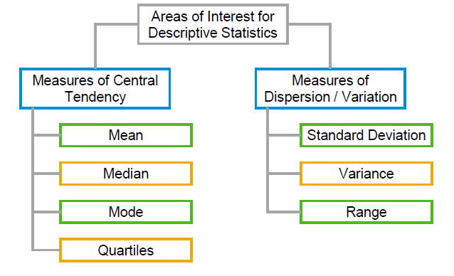
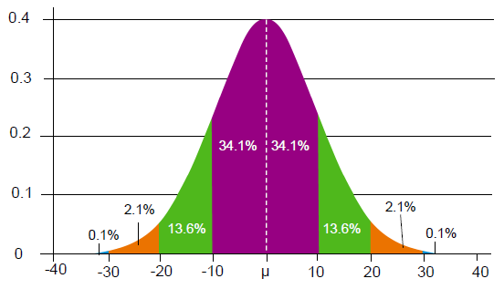
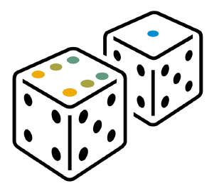
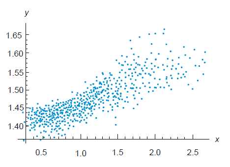

# 1. Introduction to Statistics

## Numbers are everywhere

* During every hour of every day, we make
decisions and judgments based on data.
For example, a house purchase ...

  * Location
  * Size of Town
  * Proximity to services, shops, and sea
  * Crime rates
  * Property prices
  * Size and number of rooms
  * Condition of houes

## What is a statistical problem (Jargons == Initial key terms )

* How much sleep does the average person get?
* Is there a difference by age/gender/ethnicity etc?
* What lifestyle characteristics influence sleep quantity and quality?
* How do I test whether a sleep intervention is effective or not?

## What is a statistical problem in business

* How much profit are we making?
* How many product defects are we discovering? What’s the trend?
* Has the process change led to a significant increase or decrease in employee satisfaction?
* What is our customer churn rate?

## Some key statistical terms

* Population versus sample
* Randomness
* Descriptive statistics
* Distributions
* Inference
* Probability
* Correlation

### 1. Population versus sample

**“Population"** data sets and **"sample"** data sets
* A **population** data set contains all members of a specified group (the entire list of possible data values).
* A **sample** data set contains a part, or a subset, of a **population**. The size of a **sample** is always less than the size of the **population** from which it is taken.

### 2. Descriptive statistics

* **Descriptive** statistics attempt to summarize a large body of data so that you can highlight key information.
* This is mainly through measures of central tendency and measures of dispersion.

### 3. Distributions

* A *frequency* distribution provides a way of viewing all the values of a sample in a table view or a histogram.
* A *probability* distribution is a mathematical function that describes the probability of getting any particular result,such as the outcome when you roll 2 dice.

### 4. Probability

* Probability is a statistical measure of the likelihood
of an event happening.
* Probability is measured between 0 and 1, so that
at 0, an event definitely will not happen and at 1 it
certainly will.
* Most probabilities fall between the two figures.

### 5. Correlation

* In statistics, dependence or association is any statistical relationship, whether causal or not, between two random variables.
* This statistical relationship is described as correlation.

