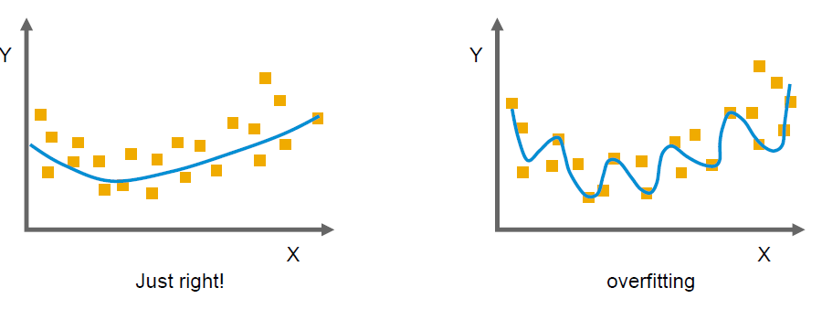

# Bias

▪ Bias refers to the tendency of a measurement process to over or under-estimate the value of a population parameter.

▪ In survey sampling, for example, bias would be the tendency of a sample statistics to systematically over or under-estimate a population parameter.

▪ There are may different types of bias.

    a. It can be introduced at the stage of data collection, with surveys and questionnaires.
    b. It can be bound up with the approach we take to analyze the data.
    c. There are also a whole set of cognitive biases which influence how we as human interpret the data.

## Different Type of Bias

▪ We will look at some of the different types of
bias:
− Selection/sampling bias
− Self-selection bias
− Confirmation bias
− Overfitting
▪ “Unlike error related to random variability, bias
cannot be assessed without external knowledge
of the world”

### Sampling Bias

### Self-selection bias

▪ If you use data taken from a voluntary response sample,
i.e. the participants volunteered to take part, it becomes
very difficult to avoid bias.
▪ The self-selected group will contain more participants
with a particular set of beliefs about your study.

### Confirmation bias

▪ “Confirmation bias” is one of a range of
“cognitive biases” that affect how we read
and interpret the insights we think we have
found.
▪ “Cognitive bias” means that it is inbuilt into
us, as humans, and how we think.
▪ “Confirmation bias” reflects our tendency
to pick out those parts of the data and
information in a way to support our
previously held beliefs.

### Overfitting and extrapolation

In predictive model one of the most important topics is underfitting and overfitting.

_**Overfiting**_ refers to a model that has close fit to the data with which it was trained, but it does not generalize, meaning that, when we actually come to use it and forecast values other than we use for training, it actually predicts these eith very high error.

_**Underfiting**_ means that the model does not fit even eith the training data very well.

