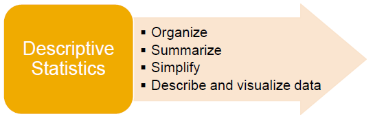
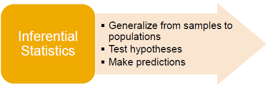
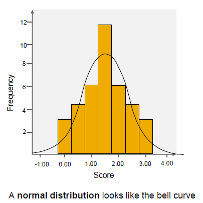
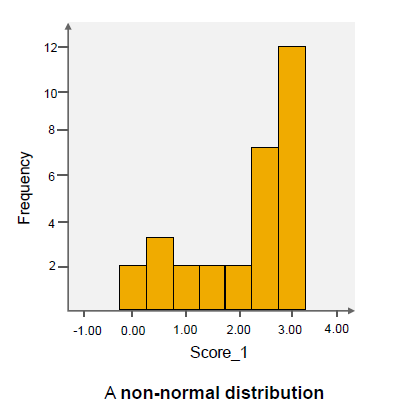
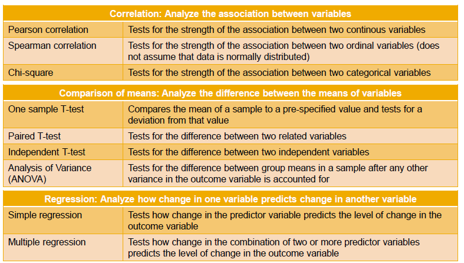
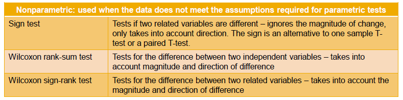

# Different Kinds of Analytic Approaches

## Qualitative vs. quantitative data

▪ The type of analytical approach you take depends on the type of data you have collected and the question
you are answering.
▪ There are two types of data: **qualitative** and **quantitative**.

    a. Qualitative Data
        ▪ Qualitative → Quality
        ▪ Deals with descriptions
        ▪ Data can be observed but not measured
        ▪ Colors, textures, smells, tastes, appearance, etc.
        
        e.g.
            1. Data captured from a focus group to understand participants perceptions: 
            Tha data could be in freeform, so it's a narrative, and you use qualitive techniques to identify content and identify themese

    b. Quantitative Data
        ▪ Quantitative → Quantity
        ▪ Data that can be measured
        ▪ Length, height, area, volume, weight, speed, time, temperature, cost, etc.
        ▪ Annalysis required statistical techniques.

        e.g.
            1. If you analyze satifaction survey where participant rated their experience pon a scale of one to ten, 
            the data is numeric in form, and it can be measured.
            You use statistical techniques to draw conclusion about participitants satifaction.

## Descriptive vs. inferential analysis

▪ There are two common types of analysis that are referred to as “_descriptive_” and “_inferential_”.

### Descriptive analysis

▪ It informs you about the basic qualities of the data.
▪ It includes basic descriptive statistics, such as the range, minimum and maximum value, nd frequency.
▪ It also includes measure of central tendency, such as , mean median, mode and standard deviation.
▪ It tells you what the data look like, and it helps you to simplify and to summarize data, and as welll as describe and visualize that data.

### Inferential analysis

▪ It uses statistical techniques to analyze whether a pattern in the data is due to chance or due to intervention that is being observed. And what the strength of that relationship is can also be seen in that.
▪ So the first step is to understand the data distribution. Is it normal or non-normal?

* If the data are normally distributed, you will generally choose from a range of parametric tests.
* If the data are non-normally distributed, you will choose from the set of nonparametric tests.

## Normal vs. Non-Normal Data Distribution

▪ For inferential statistics, you need to understand the data distribution.

### Nnormal Distribution

### Non-Normal Distribution

## Common parametric statistical tests

## Common nonparametric statistical tests

## Choosing parametric or nonparametric statistical tests

▪ It can sometimes be difficult to assess whether a
continuous outcome follows a normal distribution and
whether a parametric or nonparametric test is
appropriate.
▪ The most practical approach to assessing normality
involves analyzing the distribution of the outcome in
the sample using a histogram.

**Note:** Nonparametric test are sometimes called distribution-free tests because they are based on fewer assumptions. They do not assume that the outcome is approximately normally distributed.

**Note:** Parametric tests involve specific probability distributions, for example, the normal distribution, and the tests involve estimation of the key parameters of that distribution:
For example, the mean or difference in the means from the sample data.

There are also several statistical tests that can be used to assess whether data are likely to be coming from a normal distribution, and each test is essentially a goodness-of-fit test and compares the observed data to quantiles of the normal distribution for other specified distributions.

## Summary

▪ **Descriptive analysis** informs you about the basic qualities of the data.
▪ **Inferential analysis** uses statistical tests to analyze whether a pattern in the data is due to chance or due to the intervention that is observed, and what the strength of that relationship is.
