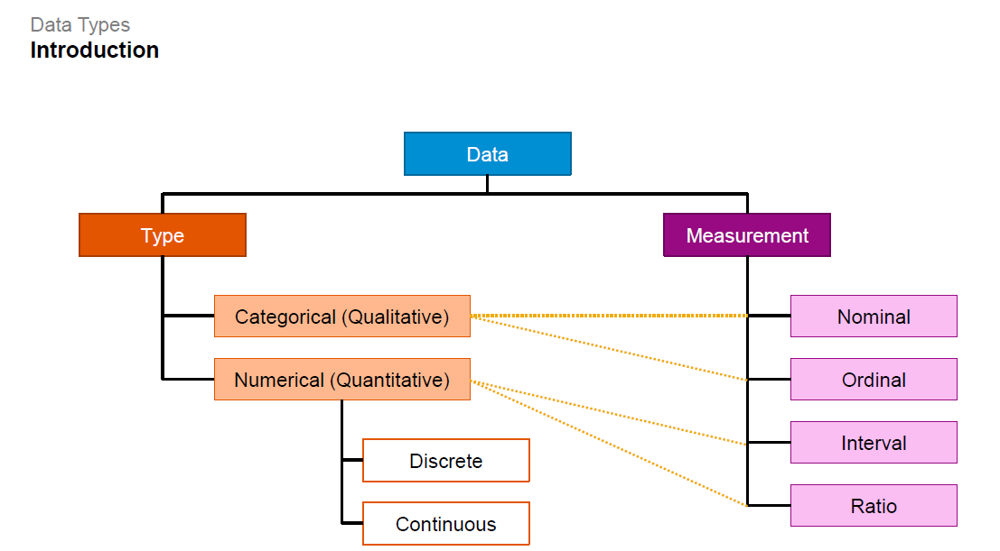
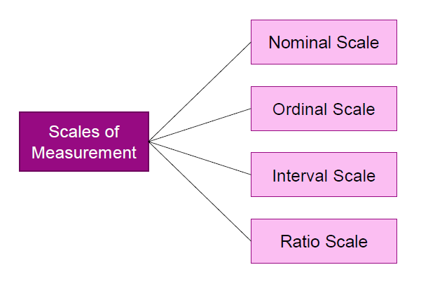
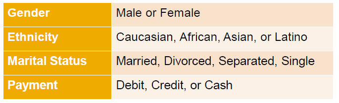
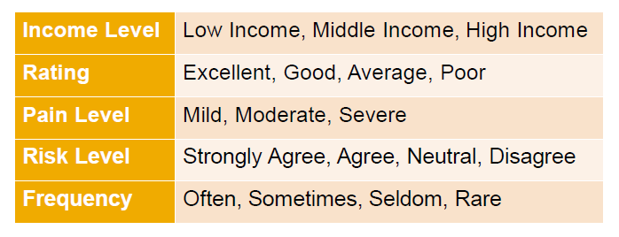
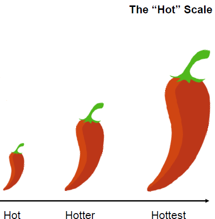

# Data Types

## Quantitative or Qualitative

1. **Quantitative or Numerical Data**
    ▪ Age of a person (28 years)
    ▪ Height of a person (1m 72cm)
    ▪ Exam score (85%)
    ▪ Dollar amount of salary
    ▪ Note: Numerical Data can be _discrete_ or _continous_
    ▪ Quantitative data can be counted or measured and summerized using mathematical operations such as addition or subtraction.

2. **Qualitative or Categorical Data**
    ▪ Gender of a person
    ▪ Ethnicity of a person
    ▪ Grading system (A, B, C, D)
    ▪ Income level (low, medium, high)
    ▪ These data are not numbers or, if they are, they cannot be quantified.
    ▪ Such data items can be placed into distinct categories based on some attribute or some characteristic.
    ▪ These data can be summarized by frequency count or model.
    ▪ No other mathematical operators can be applied.

### Discrete Data

▪ Discrete Data is based on counts.
▪ Only a finite number of value is possible, and the values cannot be subdivided meaningfully.
▪ For example:

* The number of parts  damaged in a shipment,
* Number of students in the class.

▪ Discrete Data is typically counted in whole numbers.

### Continous Data

▪ Countinous Data can me measured on a continuum or scale.
▪ Cotinous Data can have almost any numeric value and can be meaningfully subdivided into finer and finer increments depending upon the precision of the measurement.
▪ For example:

* Weights. We have to watch the weight of one of my cats as it never stops eating.

## Scales of Measurement

▪ It refer to ways in which variables or numbers are defined and categorized.

▪ Each scale of measurement has certain properties which, in turn, determine the appropriateness for use for certain statistical approaches and analyses.

▪ There are four kinds of measurement scale.

▪ There are four issues to consider when measuring variables.

* Firstly, can the items be placed in separate categories? if yes, you should use a **Nominal** or **Ordinal** scale.

* Can we rank or order the items from lowest to highest? In that case, you should use an **Nrdinal** scale.

* Can we say how much one item is more in value than the other item? For this you should use an **Interval** scale.

* Can we say how many times one item is more in value than the others? Here, we'd use a raio scale.

### Nominal Scale

▪ Nominal datacan be placed in separate categories to distinguish one from the other.
▪ You can not rank the categories on a value scale, therefore,you can not say if one category is higher or lower than the other.
▪ Nominal data differ and can be distinguished qualitatively, but not quantatitatively.
▪ Also, data can not be manipulated mathematically. You can't add, subtract, divide, or multiply.
▪  The only statistical calculations that can be applied are frequency count or mode.
▪ For ecxample:

* You can count that there are 30 females and 25 male students in the class.

### Oridinal Scale

▪ Oridinal data can be placed in separate categories to distinguish one item from the other.
▪ You can rank the data from lowest to highest in value so the dat can be placed in an order.
▪  Although data can be ranked, you can not establish the actual interval or difference between two categories.
▪ Data cannot be manipulated mathematically.
▪ Only statistical calculations that can be carried out are frequency count, median, or mode.

### Interval Scale

▪ Interval data is numbers and can be quantified.
▪ Data can be ranked from the lowest to the highest.
Not only can you say one item is greater or smaller
than the other item (example:15 Celsius is warmer than
5Celsius), but you can also say by how much or by how
much less (example: 15 Celsius is warmer than 5 Celsius by
10 Celsius).
▪ You can establish the numerical intervak difference between two items, but you cannot calculate how many times one item is more or less in value than the other.
▪ You can only apply limited mathematical operations
such as addition and subtraction to manipulate
interval data, but you cannot use division or
multiplication.
▪ Examples: Dress Size, Shoe Size, IQ Level,
Temperature (Celsius or Fahrenheit)

### Ratio Scale

▪ Data are numbers and can be quantified.

▪ Data can be ranked from the lowest to the
highest.
– For example, a person who is 12 years of age is younger than a person who is 36 years of age.

▪ Examples: Price ($), Income ($), Age (years),
Weight (kg), Distance (miles or centimeters).

▪ You can establish the numerical interval difference between these two items.
– For example, the difference in age between 12-year-old and a 36-year-old person is 24 years

▪ You can also establish how many times, or the ratio, one item iss more or less in value than the other.
– For example, a person who is 36 years of age is three times older than a person who is 12 years of age.
**Note:** The starting point of zero is an absolute point, which means it represents absolute zero. As a result all mathematical operations can be performed, including addition, subtraction, division, and multiplication.
