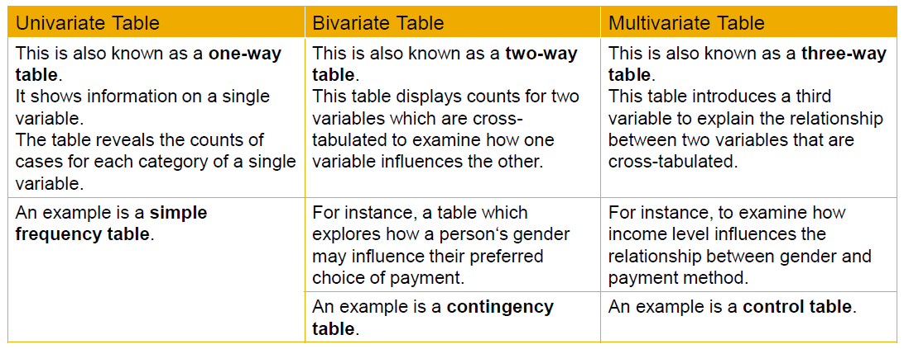
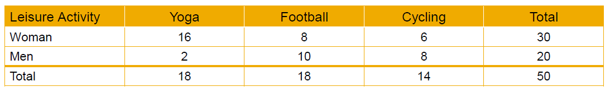
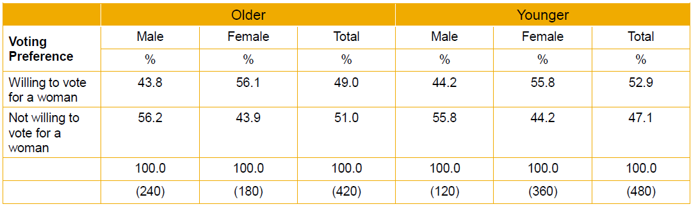
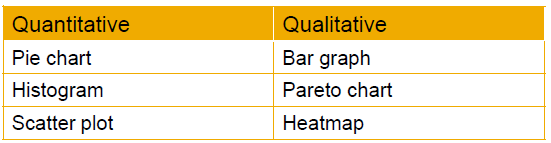
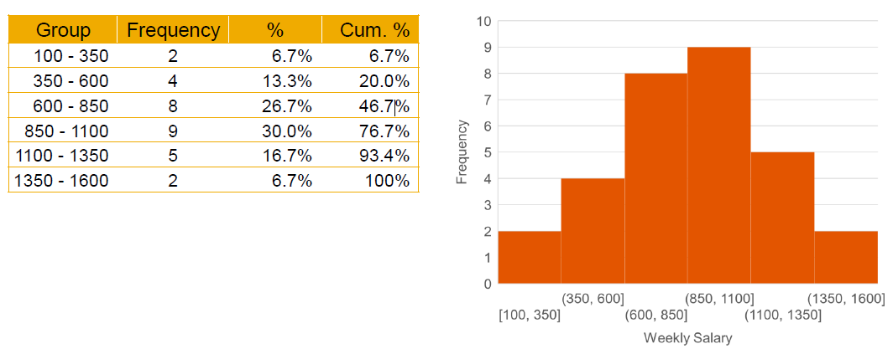

# Introduction to Data Tabulation

▪ When conducting the statistical study, a resseracher must gather data for each of the particular variable to be studied.
▪ The researcher needs to organize the data in some meaningful way.
▪ Then after organizing the data, the researcher must present the data.
▪ A very useful method of organizing and than presenting data is to **contruct tables**.
▪ The type of table to use will depend on the scope and object of the investigation
▪ The process of placing classified data into tabular form is known as **tabulation**. And this is th sytematic arrangement or orderly presentation of the statistical data in columns or rows to explain the problem that under consideration.
▪ Tabulation prepares the ground the for the analysis and interpretation.
▪ It helps in drawing the inference from the statistical figures.
▪ There are three main types of table.

## Univariate Table

▪ This simple univariate table example showss dress choice for 10 ladies
▪ The data that apppears in one-way table can easily be represented in a **bar chart**.
▪ Both bar chart and one-way tables are used to visualize categorical data in the form of **frequency counts** or **relative frequencies**.
▪ **Frequency counts** refer to the number of times a specific event occurs.
▪ **Relative Frequencies** refer to the numer of times a specific event occurs in relation to the total population.
For e.g. The _relative frequency_ of a lady preferring a red dress is 5 divided by 10, or 50%.

## Bivariate Table

▪ Bivariate or two-way tables are ideal for analyzing relationships between categorical variables.
▪ They are some times referred to as contingency tables or as **cross-tabulations**.
▪ The bivariate table below shows data on the leisure activity of 50 adults, with preferences  broken down by gender.
▪ The relative frequency for an event is calculated by dividing the number of times the event occurred by the total number of events.
▪ For e.g. The relative frequency of men preferring football is divide by 50, or 20%.

## Multivariate Table

▪ Often, the behavior you are analyzing is too complicated to be studied with only two variables. Therefore you will want to consider sets of three or more variables (called multivariate analysis).

▪ Once you have conducted  you bivariate analysis, you identify a thirs variable that you want to consider.
This is called the **control** or **test** variable.
You then seperate the cases in your sample by the categoies of the control variable.
In this example, an initial bivariate analysis was conducted to analyze if females were more likely than males to say they were willing to vote for a woman.
Than a control variable was introduced toi see if age, split into _younger_ and _older_ older participants, had an effect.

## Introduction to Data Visualization

### Quantitative Data - Pie Charts

▪ A pie chart is best used for nominal data where there are a small number of categories.
▪ Pie charts enable quick interpretation of the data with few mathematical skills.
▪ However, it's not appropriate to use a pie chart to compare twq categories.
▪ Pie charts represent data size more accurately and allow for easier comparisons between the datasets.
▪ Pie charts are relatively clumsy and lose visual clarity when they are too many categories represented.
▪ As a rule of thumb, 10 or more categories are usually too amny for a pie chart.
▪ Pie charts are not vey popular because they are many problems associated with their interpretation. The brain is not very good at comparing the size of the angles. There is no scale, so reading accurate value can be difficult. And as you add moe segments and colors,the problem gets worse. Labels can be hard to fit, especially to smaller segments, so often legends are required.

### Quantitative Data - Histogram

▪ A histogram is a graphical representation of a **frequency** table, with percentage values plotted on the vertical axis, and the class intervals shown along the horizontal axis.
▪ A histogram looks very much like the bar graph used for qualitative data.
▪ Histograms are used for quantitative data.
The vertical bars are placed side by side, with no space in between them. This is done to reflect the continuous nature of quantitative data as opposed to the categorical nature of qualitative data.

_**Baqi Baad Main.**_
