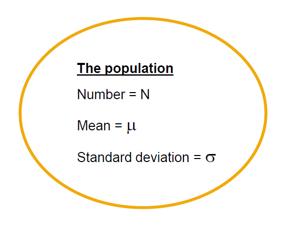
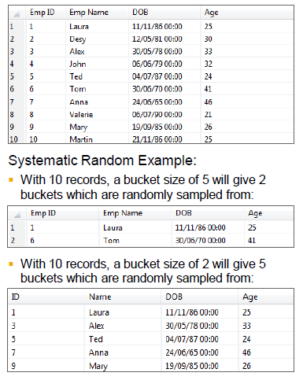
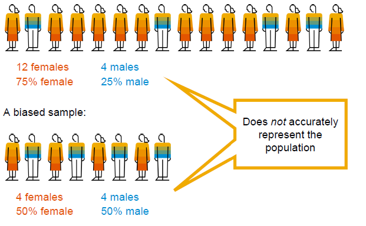

# Introduction

▪ **Population:** the entire group of items or individuals being studied
▪ **Sample:** a part of the population being studied.

▪ A representative sample of the population is needed inorder to make an accurate prediction based on the data or to make valid inference.

▪ **Unbiased** sample is a sample taht is selected so that it's representative of the entire population.
▪ An unbiased sample is selected at random and is large anough to provide accurate data.

▪ **Biased** sampple, in contrast, is sample taht's drawn so that one or more parts of the population are favored over others.

## The Population

▪ Often with large populations, it is not possible or practical to measure the parameters of the whole population.
▪ There are constraints such as cost and time that prohibit the collection of data from the whole population. Therefore, the mean and standard deviation values for the whole population might never be known.

▪ The population is described by the number capital **N**, mean is mu(**μ**) and standard deviation is sigma(**σ**)

## General Kinds of Sampling

1. Haphazard sampling
This kind of sampling is based on convenience and/or self-selection.
For e.g. street corner interviews, television call-in surveys, questionnaires published in newspapers or magazines or even online.
2. Quota sampling
Quota sampling: In this case, categories and proportions of the sample are predefined.
3. Probability sampling
Probability sampling is a sample of the population in which each person has a known chance of being selected.

## Common sampling approaches

1. First N, Last N
takes a predefined number or percentage.

2. every Nth
every Nth, samples certain numbers of data, for example, only taking every fifth sample.

3. Simple Random
This is a number or percentage.

4. Systematic Random
It takes buckets and randomly samples from each bucket.
For e.g.

    * This example shows the results of sampling from a table with 10 records, first with a bucket size of five which gives two buckets and then with a bucket size of two that will give five buckets to be randomly sampled.

5. Stratified Sampling
Stratified sampling, this is where the population is separated into groups called strata. Then a probability sample, which is a simple random sample, is drawn from each group.

## The Random Sample

▪ Since we cannot analyze the whole population, we often choose to draw a random sample from that population. In this case, the sample size is small **n**, the sample mean is represented by **x̄**, and the sample standard deviation by small case **s**.

▪ Sampling error can occur such that there's a difference between the population mean and the mean of the sample.

## Sampling Bias

▪ Sampling bias is a bias in which a sample is collected in such a way that some members of the intended population are less likely to be included than others. This results in a baised sample. And this would be a non-random sample of a population in which all individuals or instances were not equally likely to have been selected.

If the sample selection process is based on personal rejudice or bias of the analyst, then the results will clearly be prone to bias errors, or systematic errors.
