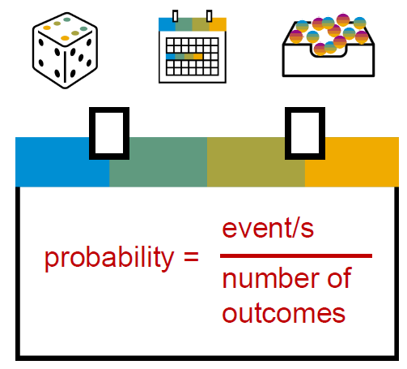
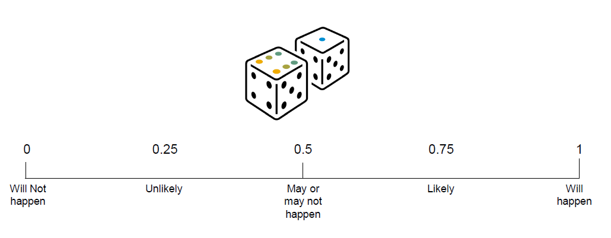
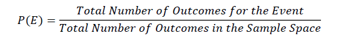

# Introduction to Prbability

▪ There are many times in modern life where you would like to predict the likely outcome of an event or series of events.
E.g:

1. What's the probability of randomly drawing a face card from a deck of cards?
2. What is the probability of throwing a seven using two dice? What's the probability of raintoday?
3. Should I take an umbrella with me?
4. How likely is it that Liverpool will beat Manchester United based on recent form?

A few more complex E.g:

1. What's the probability of having an adverse reaction to a drug?
2. Is it worth the UK National Health Service investing in this particular new drug?

And much more complex: What is the likelihood, for E.g:

1. climate change is manmade?
2. What's the likelihood that this cluster of customers is needing to make a house insurance claim?

## Some Symbols

Here are some commonly used symbols and
conventions:
▪ P(A) – The probability of event A
− The probability of throwing a six with a die – P(6)

▪ P(A ∩ B) – The probability of event A and B
− The probability of throwing 2 sixes – P(6∩6)

▪ P(A ∪ B) – The probability of event A or event B
− The probability of choosing one card from a standard deck and getting either a Queen of Hearts or King of Hearts

▪ P(A|B) – The probability of A given prior event B
− The probability of being diagnosed with cancer given that the patient is a smoker

## What is probability

▪ Probability is typically represented between zero and one or as a percentage.

1. So zero means that the event is impossible.
2. One means that the event will certainly happen.
3. Any number in between represents the probability but not certainty of the event.

For E.g:

A probability of 0.7 for rain today means that the weather forecastershave calculated a probability of 70% that it will rain today.

**Note:** this is not through some magic but by calculating all the possible outcomes.

## How do I calculate the probability of an event

Calculate all possible outcomes for an event (the “sample space”).

▪ For example, there are 6 possible events (outcomes) when throwing one die:
▪ S = {1,2,3,4,5,6}

▪ To calculate the probability of an event you use the
following formula:

▪ What is the probability of throwing a six?
– P(E) = 1/6 = 0.16 or 16%

▪ What is the probability of throwing an even number?
– P(E) = 3/6 = 0.5 or 50%

**Note:**  this calculates probabilities when each outcome is equally possible. We'll look later on at real-world situations where this is not the case.

Music style | # of people who prefer
------------|-----------------------
Rock        | 20
Disco       | 10
Hip Hop     | 15
Reggae      | 25
Classical   | 30
Total       | 100

If you choose a random person, what is the likelihood that they like classical music?
P(E) = Frequency for classical / Total frequencies in table
P(E) = 30/100 = 0.3
