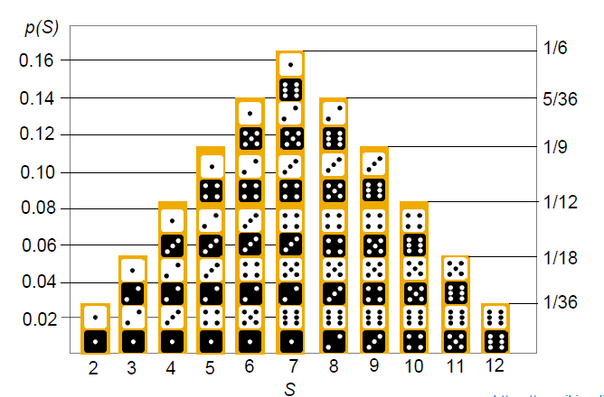
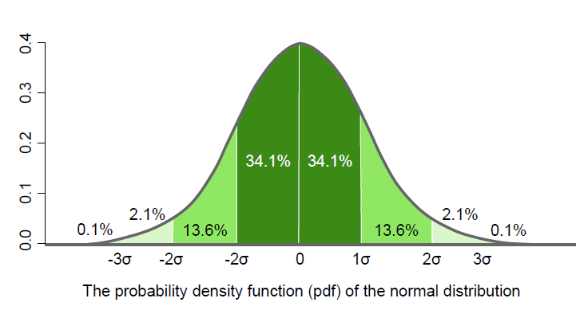

# Probability Distributions

▪ A probability distribution is a mathematical function that provides the probabilities of occurrence of different possible outcomes in an experiment.

For E.g.
If the random variable x is used to denote the outcome of a coin toss, which is the experiment, then the probability distribution of x would take the value 0.5 for heads, and 0.5 for tails, if the coin is fair.

## Types of Probability Distribution

1. Discrete Probability Distribution
▪ The set of possible outcomes is discrete
For E.g. Rolling a Dice or Tossing a Coin

2. Continuous Probability Distribution
▪ The set of possible outcomes can take on values in a
continuous range
For E.g. Temprature over a day
**Note:** Normal Distribution commonly encountered continous distribution.

## Discrete Probability Functions

Discrete probability functions are also known as **probability mass functions**. These can assume a discrete number of values. For E.g. you can have only heads or tails in a coin toss. Similarly, if you're counting the number of cars sold per day by a car sales company, you can count 10 or 11 cars but nothing in between.

For discrete probability distribution functions, each possible value has a **non-zero likelihood.** The probabilities for all possible values must **sum to one**.
For E.g. the likelihood of rolling a specific number on a dice is one divided by six. The total probability for all six values equals one. When you roll a die, you will definitely obtain one of the six possible values.

The correct discrete distribution depends on the properties of your data. For E.g.

1. Binomial distribution to model binary data, for example, a coin toss.

2. Poisson distribution to model count data, for example, the count of cars sold per day.

3. Uniform distribution to model multiple events with the same probability, for example, rolling a dice.

In the diagram below

The probability mass function specifies the probability distribution for the sum of counts from two dice.
For E.g. The figure shows that the probability of throwing an 11 is two divided by 36 or 1/18.

This computation of probabilities of events is, for example, the probability of throwing the dice with a combined value greater than nine. This means you add together the probability for dice combinations of 10, 11, and 12, this is equal to 1/12 plus an 1/18 plus a 1/36.

## Discrete Probability Example

Number of Heads | Probability
----------------|------------
0               | 0.25
1               | 0.50
2               | 0.25
Flip a coin two times

Suppose you flip a coin two times. This simple statistical experiment can have four possible outcomes. Let the random variable x represent the number of heads that result from this. The random variable can only take on the values zero, one, or two. So it's a discrete random variable.

You can see that the table represents a discrete probability distribution because it relates each value of a discrete random variable with its probability of occurrence.

## Continuous Probability Functions

Continuous probability functions are also known as **probability density functions** or a **pdf**.

Probabilities for continuous distributions are measured over ranges of values, rather than single points. Therefore, a probability indicates the likelihood that the value will fall within an interval. In a continuous distribution, the variable can assume an infinite number of values between any two values.

For E.g.
Continuous variables are often measurements on a scale, such as _temperature_, _height_, and _weight_.

**Note:**  

* Specific values in continuous distributions can have a **zero** probability
* On the probability plot, the entire area under the distribution curve equals one.
* The proportion of the area under the curve that falls within a range of values along the x-axis represents the likelihood that a value will fall within that range.
* Each continuous probability distribution has parameters that define its shape. When you specify these parameters, they establish the shape of the distribution and all of its probabilities.
* The parameters represent essential properties of the distribution, such as the **central tendency** and the **variability**.
* The most commonly encountered continuous distribution is the **normal distribution**, which is also known as the **Gaussian distribution** or the **bell curve**.
* It's defined by two parameters: the **mean** and the **standard deviation**.
* The **Weibull distribution** and the **lognormal distribution** are other commonly encountered continuous distributions. Both of these distributions can fit skewed data

## Continuous Probability Example 1

## Continuous Pobability vs Discrete Probability Distribution

There are three main differences between a continuous and a discrete probability distribution.

1. Firstly, the probability that a continuous variable will take a specific value is equal to zero.
2. Secondly, because of this, continuous probability distributions are not displayed in a tabular form.
3. And thirdly, a graph with specified parameters, for example, the mean and the standard deviation, are used to describe continuous distributions.
