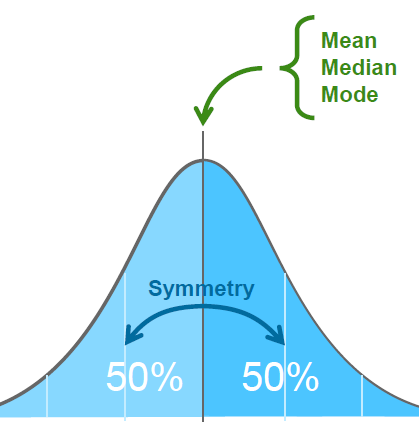
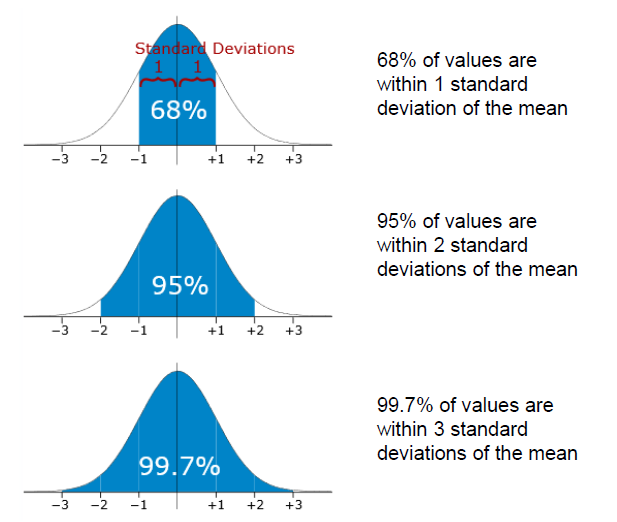
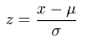
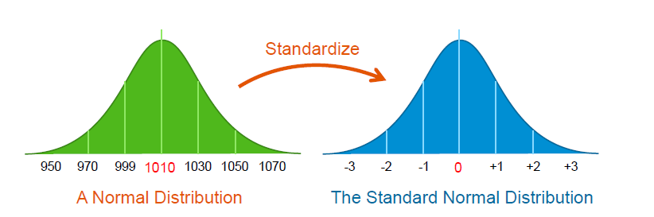
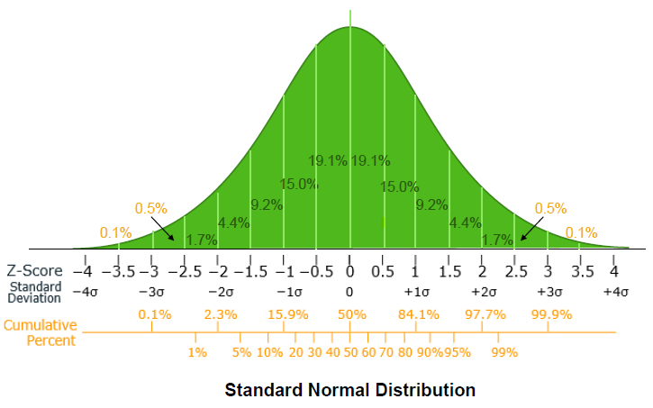
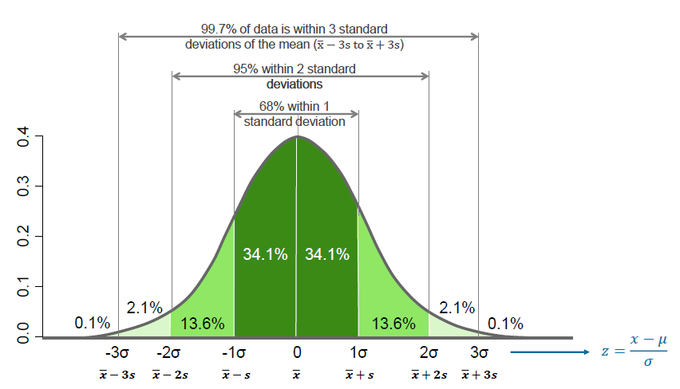
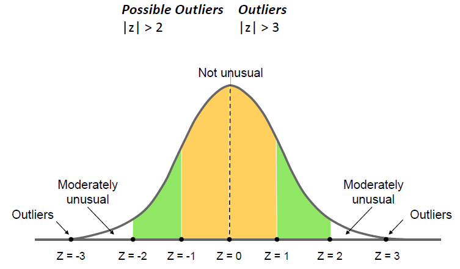

# Introduction

* In many cases, data tends to a central value, with no bias left or right. This is called a **normal distribution**.

* The normal distribution is often called a **bell curve** because it looks like a bell, or referred to as the **Gaussian** or **Gauss-Laplace distribution**. It's a very common continuous probability distribution.

* Normal distributions are important in statistics and often used in the **natural** and **social sciences** to represent **real values**, and real-valued **random variances**, whose distributions are not known.

## Characteristics

The characteristics of the normal distribution:

* mean = median = mode
* symmetry about the centre
* 50% of values less than the mean and 50% greater than the mean
* The total area under the normal distribution is equal to 100%
* It's asymptotic, meaning the two tails of the curve fall and extend indefinitely in both directions, but never touching the x-axis. Thus, it has infinite range.
* The location of a normal distribution is determined by the **mean** and the **spread**.
* The spread is determined by the **standard deviation**.
* Distance away from the mean is measured in **standard deviation**s, also known as **z-scores**

## Standard Deviation

The number of standard deviations from the mean is also called the **standard score**, **sigma**, or **z- score**.

## Standard Normal Distribution

* To convert a value to a standard score, the z- score, subtract the mean, divide by the standard deviation.
* This is called standardizing
* The formula for the z-score:

**Where**:
z is the "z-score" (standard score)
x is the value to be standardized
μ is the mean
σ is the standard deviation

## Standard Normal Distribution Example

**Question:** Here is an example using the standard, normal distribution. In a recent data science test, you did really well, and scored 1.5 standard deviations above the average. How many students scored lower than you?
**Answer:** From the graph you can see, that between zero and 1.5 standard deviations, the percentage population is 19.1, plus 15, plus which equals 43.3%. Less than zero is 50%, the left half of the curve. Therefore, in theory, the total less than yours is 50% plus 43.3, which is 93.3%. That's a very good result.

## Empirical Rule

* The empirical rule states that for a normal distribution, nearly all of the data will fall within **three standard deviations of the mean**.
* The rule is also called the **68-95-99.7 rule**, or the **three sigma rule**.
* The empirical rule is often used in statistics for forecasting, especially when obtaining the right data is difficult or impossible to get.
* The rule can give you a rough estimate of what your data collection might look like if you were able to survey the entire population.
* This rule applies, generally, to a random variable, x, following the shape of a normal distribution.
* The rule doesn't apply to distributions that are not normally distributed, but you can apply it to other kinds of distributions using Chebyshev's theorem.

## Rules of Thumb for Detecting Outliers

* The z-score can be used to indicate if a measurement is deemed to be an **outlier**.
* Observations with z-scores **greater than three** in absolute values are
* For some highly skewed data sets, observations with z-scores greater than two in absolute values may also be outliers.
* However, the presence of one or more outliers in a data set can inflate the computed values of the standard deviation.
* However, it is unlikely than an error observation would have a z-score larger than absolute three.

**Note:** In a previous lesson, you were introduced to box plots. In contrast to z-scores, the values of the core tiles used to calculate the intervals for a box plot are not affected by the presence of outliers.

## Central Limit Theorem

* The central limit theorem (CLT) establishes that when independent random variables are added, their properly normalized sum tends towards a normal distribution even if the original variables themselves are not normally distributed.

**Note:** The theorem is a key – that is, central – concept, because it applies that probabilistic and statistical methods that work for normal distributions can be applicable to many problems involving other types of distributions.
A **simple example** of this is that if you flip a coin many times, the probability of getting a given number of heads in a series of flips will approach a normal curve, with a mean equal to half the total number of flips
