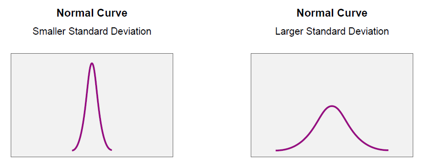
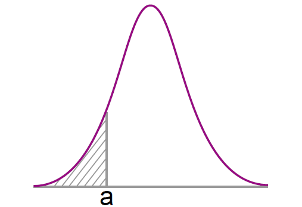
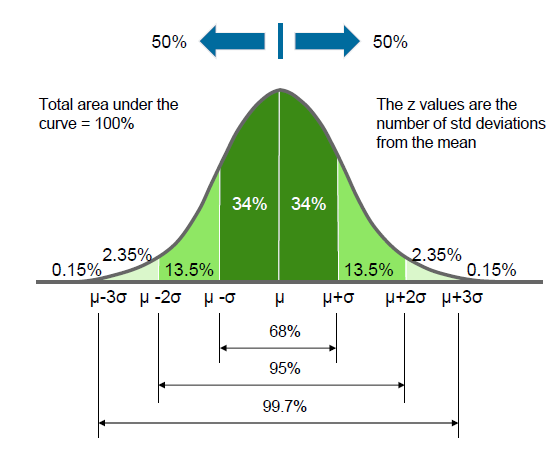
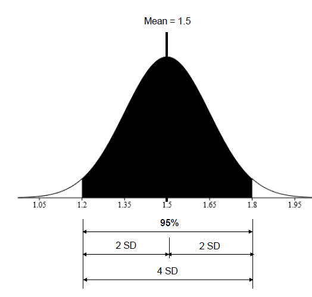

# Introduction

## Normal Distribution

**Recap**:

* The normal distribution refers to a family of continuous probability distributions.
* The graph of the normal distribution depends on two factors:
    1. Mean
        * The mean of the distribution determines the location of the center of the graph
    2. Standard Deviation.
        * Standard deviation determines the height and width of the graph.
* All normal distributions look like a symmetric, bell-shaped curve.
* When the standard deviation is small, the curve is tall and narrow, and when the standard deviation is big, the curve is short and wide.

## Probability and the Normal Distribution

**Recap**:

* The area under the normal distribution can be used to calculate probabilities for a normally distributed random variable.
* This means that the probability that a normal random variable X equals any particular value is zero.
* The probability that X is greater than a is equal to the area underneath the normal curve between a and plus infinity, the non-shaded area in the diagram.
* The probability that X is less than a is equal to the area under the normal curve between a and minus infinity. That's the shaded area in the diagram.
* The total area under the curve is equal to one.

## Empirical Rule

**Recap**:

* About 68% of the area under the curve falls within one standard deviation of the mean.
* About 95% of the area under the curve falls within two standard deviations of the mean.
* About 99.7% of the area under the curve falls within three standard deviations of the mean.
* This is known as the empirical rule or the 68-95-99.7 rule.
* Therefore, given a normal distribution, most outcomes will be within three standard deviations of the mean

**Question:1** (Empirical Rule)

* 95% of students at school are between 1.2m and 1.8m tall.
* Assuming this data is normally distributed, calculate the mean and standard deviation.

**Answer:** 1
The mean equals 1.2 plus 1.8 divided by 2, and so, that equals 1.5 meters.
95% is two standard deviations either side of the mean, a total of four standard deviations. Therefore, one standard deviation equals 1.8 meters minus 1.2 meters divided by 4, which equals 0.15 meters.

## Find Probabilities

* How can you use this theory in practice?
* To find the probability associated with a normal random variable,
* use a graphing calculator, an online normal distribution calculator,
* or a normal distribution table.
* There are lots of normal distribution calculators available online.
* Using the Normal Distribution to Calculate Probability
* Find probabilities
* Here are some examples for you:

https://www.mathportal.org/calculators/statistics-calculator/normal-distribution-calculator.php
https://stattrek.com/online-calculator/normal.aspx
https://www.hackmath.net/en/calculator/normal-distribution
http://davidmlane.com/hyperstat/z_table.html

**Question:1** (Probabilities)
On average, a light bulb lasts 300 days with a standard deviation of 50 days.
▪ Assuming that bulb life is normally distributed, what is the probability that the light bulb will last at most 365 days?
